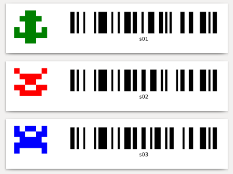

# Barcode and dynamic picture

In this example we will print an identicon and a barcode for each label.

<p align='center'></p>

This example shows:

- How to use ``label_tools.barcode``
- How to transform a picture generated on-the-fly into base64 data so it can be integrated into a ```` tag.
- How to define extra variables or functions and use them from inside the template (here, ``generate_identicon``).

This example requires [pydenticon](https://github.com/azaghal/pydenticon) installed:

```
pip install pydenticon
```
