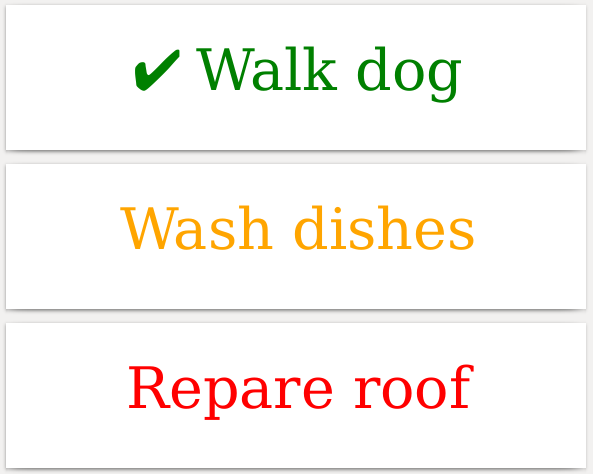

# Labels from spreadsheet

In this example we will read records from a spreadsheet and generate labels from the content.

We will use Pandas, which we recommend for reading any kind of CSV or Excel files
(with ``pandas.read_csv()`` and ``pandas.read_excel()``). The resulting dataframe
can then be converted into records with ``dataframe.to_dict(orient='record')``
and the records can be directly fed to Blabel.

