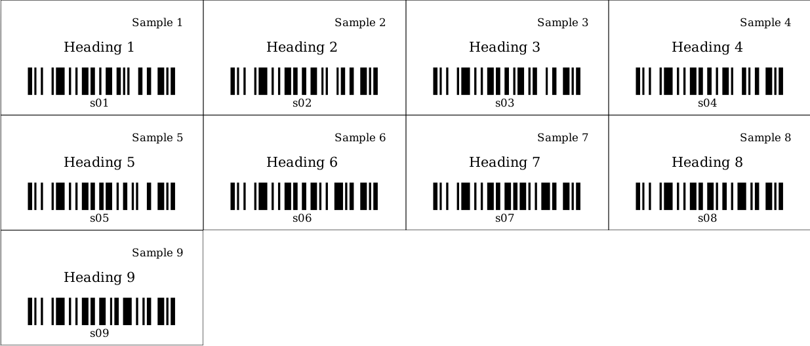
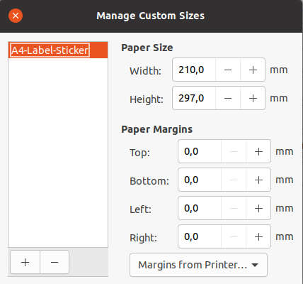

# Labels on A4 paper

In this example we will print a barcode with 2 custom text items on A4 paper. To use this example on any other paper size, you just need to change the
paper *width* and *height* in the style.css file.

You might need to change the label width and height depending on your type of paper. You can do this by changing the *width* and *height* of the *print-area* object in style.css.

In this example we will print a matrix of custom labels on A4 paper.

To print the generated PDF file to the A4 paper, it is important to set the proper configuration for the page in the printer settings. We need to set margins to 0 as shown in the example below:

