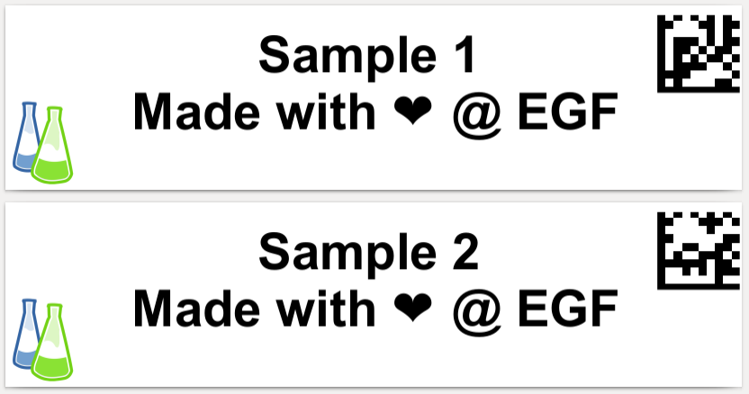

# Logo and datamatrix

In this particularly ugly example we will print a label with a datamatrix code in one corner and a logo in the opposite corner.

This example shows:

- How to use local pictures (notice that it requires to set the ``base_url`` in ``write_pdf``).
- How to use ``label_tools.datamatrix()``
